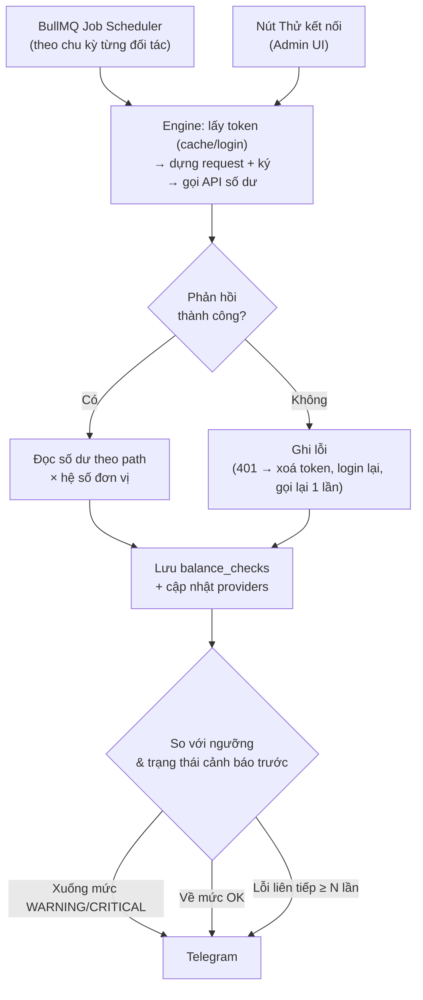
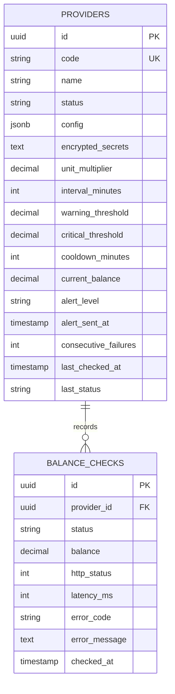

# HỆ THỐNG GIÁM SÁT & CẢNH BÁO SỐ DƯ API NHÀ MẠNG
### (Telco API Balance Monitoring System)

> **Trạng thái:** Sẵn sàng triển khai (v1 — phạm vi tối giản)  
> **Phiên bản:** 1.1.0  
> **Phạm vi:** Provider Integration Hub (`feature/balance-warning-system`)

---

## MỤC LỤC
1. [Tổng Quan](#1-tổng-quan)
2. [Luồng Nghiệp Vụ](#2-luồng-nghiệp-vụ)
3. [Đặc Tả Tính Năng](#3-đặc-tả-tính-năng)
4. [Mô Hình Dữ Liệu](#4-mô-hình-dữ-liệu)
5. [Kế Hoạch Triển Khai](#5-kế-hoạch-triển-khai)
6. [Ngoài Phạm Vi v1](#6-ngoài-phạm-vi-v1)

---

## 1. TỔNG QUAN

Hub tự động kiểm tra số dư ví API của các nhà mạng / đại lý theo chu kỳ, và báo qua Telegram khi số dư xuống dưới ngưỡng hoặc khi không kiểm tra được.

* Bỏ việc đăng nhập thủ công từng portal đối tác để xem số dư.
* Cấu hình đối tác mới hoàn toàn trên giao diện (no-code), không viết adapter riêng.
* Cảnh báo sớm để kịp nạp tiền trước khi dịch vụ nạp cước/gói data bị gián đoạn.

---

## 2. LUỒNG NGHIỆP VỤ

Lần gọi từ nút **Thử kết nối** chỉ trả kết quả về giao diện, không lưu và không bắn cảnh báo.

---

## 3. ĐẶC TẢ TÍNH NĂNG

### 3.1. Quản lý đối tác

* **Thuộc tính:** `code` (viết hoa, không dấu, duy nhất — VD `VIETTEL_DATA`), `name`, `status` (`ACTIVE` / `PAUSED`), chu kỳ quét, ngưỡng cảnh báo.
  * `ACTIVE`: quét theo lịch và cảnh báo.
  * `PAUSED`: dừng quét nền, vẫn dùng được Thử kết nối.
* **Secrets:** `password`, `clientSecret`, `apiKey`… mã hoá bằng `AesGcmSecretCipher` (AES-256-GCM) trước khi lưu.
  * Backend không bao giờ trả giá trị đã giải mã; UI chỉ hiển thị `••••••••` + "Đã cấu hình".
  * Muốn đổi phải bật công tắc "Thay đổi thông tin bí mật"; để trống = giữ nguyên.

### 3.2. Cấu hình API động (port từ engine HTTP_CONFIG cũ)

Engine đã có ở commit `646949a` (`src/modules/provider-adapter/infrastructure/adapters/http-config/`). Port lại, bỏ toàn bộ phần đơn hàng (`order.*`, submit/query/orders/packages/check), chỉ giữ `login`, `balance`, `test`.

* **Request:** Base URL, path, method (`GET` / `POST` / `PUT`), query, headers, body (`JSON` / `FORM`).
* **Biến template:** `{{vars.*}}`, `{{secrets.*}}`, `{{token}}`, `{{now.unixMs}}` / `{{now.unixSec}}` / `{{now.iso}}`, `{{uuid}}`.
* **Auth:** `NONE`, `BEARER`, `BASIC`, `HEADER`, `QUERY`.
* **Token:** gọi API login khi cache Redis chưa có/hết hạn; TTL cache = `expires_in` trừ hao an toàn; Redis lock để chỉ 1 job login cùng lúc; gặp 401 / mã lỗi phiên hết hạn đã cấu hình → xoá token, login lại, gọi lại 1 lần.
* **Chữ ký:** `MD5`, `SHA256`, `HMAC_MD5`, `HMAC_SHA1`, `HMAC_SHA256`, `HMAC_SHA512`; chuỗi gốc là body thô hoặc mẫu tự ghép (VD `{{vars.partnerCode}}|{{now.unixMs}}|{{secrets.secretKey}}`); đầu ra `HEX` / `HEX_UPPER` / `BASE64`; gắn vào header hoặc trường body.
* **Bảo vệ đích gọi:** giữ `destination-guard` (chặn gọi vào IP nội bộ).

### 3.3. Đọc phản hồi

* **Điều kiện thành công:** danh sách điều kiện trên `http.status` và `body.*` (VD `http.status IN 2xx`, `body.error IN 0`). Không đạt → lưu mã lỗi + thông điệp.
* **Số dư:** đường dẫn dot-notation (`body.data.balance`, `body.accounts.0.balance`). Chỉ chấp nhận số hoặc chuỗi số thuần; không đọc được → coi là lỗi cấu hình.
* **Hệ số đơn vị:** một số nhân, mặc định `1` (VD API trả về nghìn đồng thì đặt `1000`). Mọi số dư lưu theo VNĐ.

### 3.4. Lập lịch & worker

* Chu kỳ mỗi đối tác chọn trong: 5 / 15 / 30 / 60 phút. Đổi chu kỳ hoặc trạng thái thì cập nhật job scheduler ngay, không cần khởi động lại.
* Chạy trong `src/worker.ts` (BullMQ), tách khỏi tiến trình API.
* Timeout mỗi request 15s. Lỗi mạng tạm thời (timeout, 502/503/504) thử lại tối đa 2 lần (backoff 5s → 15s) trước khi ghi nhận lỗi.

### 3.5. Cảnh báo (Telegram)

* **Ngưỡng:** mỗi đối tác có `warning_threshold` và `critical_threshold` (VNĐ). Mức hiện tại: `OK` / `WARNING` / `CRITICAL`.
* **Kênh:** một Telegram bot + một chat ID dùng chung, cấu hình qua env (`TELEGRAM_BOT_TOKEN`, `TELEGRAM_CHAT_ID`).
* **Quy tắc gửi** (so mức mới với `alert_level` đã lưu trên đối tác):
  * Mức xấu đi (`OK → WARNING`, `→ CRITICAL`): gửi ngay.
  * Vẫn ở `WARNING` / `CRITICAL`: nhắc lại sau mỗi `cooldown_minutes` (mặc định 60).
  * Về `OK`: gửi thông báo phục hồi *"🟢 [Tên đối tác] đã được nạp, số dư hiện tại [X] VNĐ"*.
* **Lỗi kết nối:** tách riêng với cảnh báo số dư. Gửi khi lỗi liên tiếp ≥ 3 lần; gửi "đã kết nối lại" khi lần đầu thành công trở lại.

### 3.6. Thử kết nối (Test Tool)

* Nút **Thử kết nối** trên màn hình cấu hình, chạy đúng engine như job nền nhưng dùng cấu hình đang soạn (chưa cần lưu).
* Hiển thị từng bước (login nếu có, balance):
  * Request: URL đầy đủ, headers, body đã ký (secrets và token bị che).
  * Response: HTTP status, body thô, latency (ms).
  * Kết quả: token lấy được (che bớt), số dư đọc được, thành công/thất bại kèm lý do (sai điều kiện thành công, không tìm thấy path số dư, timeout…).

### 3.7. Dashboard

* **Thẻ chỉ số:** Tổng số dư (VNĐ), số đối tác đang `WARNING` / `CRITICAL`, số đối tác đang lỗi kết nối.
* **Bảng đối tác:** số dư hiện tại, mức cảnh báo, lần kiểm tra gần nhất, trạng thái lần gần nhất.
* **Biểu đồ đường:** số dư theo thời gian, lọc 24h / 7 ngày / 30 ngày, chọn đối tác.

### 3.8. Lịch sử kiểm tra

* Mỗi lần kiểm tra nền (thành công hay lỗi) ghi 1 dòng `balance_checks`. Dùng chung cho biểu đồ và tra cứu lỗi.
* Màn hình lịch sử: lọc theo đối tác, thành công/thất bại, khoảng thời gian.
* Job dọn dẹp hằng ngày: xoá dòng cũ hơn 90 ngày.

### 3.9. Phân quyền

Dùng 3 role sẵn có trong `seed-permissions.ts`, thêm permission cho subject `Provider` và `BalanceCheck`.

| Tính năng | ADMIN | MANAGER | USER |
|---|:---:|:---:|:---:|
| Xem dashboard, danh sách, lịch sử | ✓ | ✓ | ✓ |
| Sửa ngưỡng, cooldown, tạm dừng/bật | ✓ | ✓ | |
| Thêm/xoá đối tác, cấu hình API, secrets, Thử kết nối | ✓ | | |
| Quản lý tài khoản & phân quyền | ✓ | | |

---

## 4. MÔ HÌNH DỮ LIỆU

* `config`: toàn bộ spec HTTP_CONFIG (request, auth, token, signature, điều kiện thành công, path số dư) — 1 cột JSONB, validate bằng `http-config.validation` port từ code cũ.
* Index `balance_checks (provider_id, checked_at DESC)` cho biểu đồ và màn lịch sử.

---

## 5. KẾ HOẠCH TRIỂN KHAI

### Giai đoạn 1: Dữ liệu & đối tác
- [ ] Drizzle schema `providers`, `balance_checks` + migration.
- [ ] CRUD API đối tác, mã hoá secrets bằng `AesGcmSecretCipher`, không trả secrets về client.
- [ ] Thêm permission `Provider`, `BalanceCheck` vào `seed-permissions.ts`.

### Giai đoạn 2: Engine & Thử kết nối
- [ ] Port từ `646949a`: `http-config.template`, `.engine`, `.token-manager`, `.validation`, `.types`, `destination-guard`, Redis token store — bỏ phần đơn hàng, giữ test tương ứng (`template`, `signature`, `token-manager`, `balance`, `validation`).
- [ ] Thêm hệ số đơn vị vào bước đọc số dư.
- [ ] API `POST /admin/providers/test-connection` (nhận cấu hình đang soạn, trả kết quả từng bước, đã che secrets).

### Giai đoạn 3: Lập lịch & cảnh báo
- [ ] Job scheduler BullMQ theo `interval_minutes`, đồng bộ khi tạo/sửa/tạm dừng/xoá đối tác.
- [ ] Ghi `balance_checks`, cập nhật trạng thái trên `providers`.
- [ ] Telegram notifier + quy tắc mức cảnh báo, cooldown, phục hồi, lỗi kết nối.
- [ ] Job dọn `balance_checks` > 90 ngày.

### Giai đoạn 4: Giao diện web
- [ ] Danh sách đối tác + form thêm/sửa (thông tin chung, ngưỡng, chu kỳ, secrets).
- [ ] Form cấu hình API (request, auth, token, chữ ký, điều kiện thành công, path số dư) + panel Thử kết nối.
- [ ] Dashboard: thẻ chỉ số, bảng đối tác, biểu đồ đường.
- [ ] Màn hình lịch sử kiểm tra.

---

## 6. NGOÀI PHẠM VI v1

Bổ sung khi có nhu cầu thực tế từ một đối tác cụ thể:

* Chữ ký `RSA-SHA256`, `SHA-1`; ký trên tham số sắp xếp A-Z; body JSON lồng nhiều tầng.
* Kênh Slack / Email; cấu hình kênh riêng theo từng đối tác; lịch sử cảnh báo trong DB.
* Đa tiền tệ (USD, EUR, điểm) và quy đổi tỷ giá.
* Chuỗi cron tuỳ ý, trạng thái `MAINTENANCE`.
* Biểu đồ tỷ trọng, burn rate / "tiêu hao nhanh nhất", chỉ số uptime/SLA.
* Xuất Excel/CSV.
* Role riêng TECH / OPERATOR / FINANCE.
