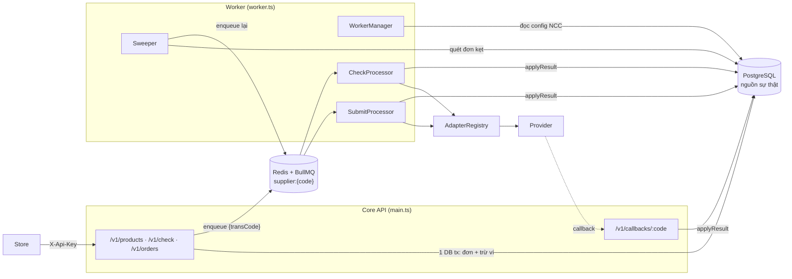
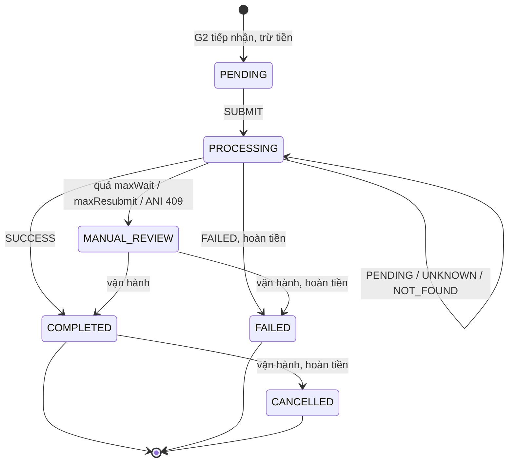

# Thiết kế Core điều phối NCC

Luồng cũ: Mua hàng → CMS → WHN → Provider
Luồng mới: Mua hàng → **Core API → Worker → Adapter** → Provider

**Nguyên tắc:**
- PostgreSQL là nguồn sự thật. Redis/BullMQ chỉ là "cò súng": mất Redis thì chậm lại chứ không sai dữ liệu.
- Chỉ có **một hàm** được đổi trạng thái đơn: `applyResult`.
- Chỉ chuyển FAILED khi NCC nói rõ là thất bại. Mọi trường hợp chưa chắc đều là UNKNOWN.

---

## 1. Những sự thật định hình thiết kế

| | SSMedia | MoMo | ANI SIM |
|---|---|---|---|
| Tạo đơn idempotent theo requestId | Có (`450`) | Có (`862600001`) | Có (khác payload → `409/4002`) |
| Timeout | Phải gọi `get_transaction` | Không được coi là FAILED | Gửi lại cùng requestId |
| Kênh kết quả | Poll | Poll | Callback (at-least-once) + poll |
| Check điều kiện | API `check` | `products?phone=` | Không có |
| Xác thực | AES + RSA | Token + HMAC | `X-API-Key` |
| Rate limit | ? | 20 / 10 RPS | 60 request/phút |

**Suy ra:**
- Gửi lại cùng `transCode` là an toàn với cả 3 NCC.
- Bắt buộc phải có outcome UNKNOWN.
- Poll là kênh chính, callback là kênh tăng tốc.
- Xác thực nằm trong adapter.

**Giữ từ WHN:**
- Config NCC dạng JSON trong DB.
- Tách 3 pha first / execute / finalize.
- Khóa ví bằng `FOR UPDATE`.
- Guard trạng thái của Leeon callback.
- Recheck với độ trễ tăng dần.

**Bỏ từ WHN:**
- Tên helper là chuỗi lưu trong DB.
- So sánh chuỗi signal.
- Gọi NCC trong khi giữ request hoặc khóa DB.
- `sleep` trong vòng lặp.
- Hoàn tiền khi kết quả chưa rõ.

---

## 2. Kiến trúc



- Một codebase NestJS, hai entrypoint: `main.ts` (API) và `worker.ts` (worker).
- Một loại worker, hai loại job: `SUBMIT` và `CHECK`.
- Hạ tầng: Postgres + Redis. Thư viện thêm: `bullmq`, `@nestjs/bullmq`.

---

## 3. Input / Output từng giai đoạn

### G0 — Danh mục gói · `GET /v1/products`
- **In:** `X-Api-Key`, query `action?`, `telco?`
- **Xử lý:** Đọc `products` đang ACTIVE, có mapping ACTIVE tới NCC ACTIVE. **Không gọi NCC.**
- **Out:** `[{ sku, name, type, telco, price, actions, attrs }]`

### G1 — Kiểm tra điều kiện · `POST /v1/check`
- **In:** `{ sku, action, phone }`
- **Xử lý:** Chọn tuyến SKU → NCC.
  - Adapter có `checkEligibility` thì gọi, timeout 3s.
  - Không có thì kiểm tra cục bộ (gói active, action được phép).
- **Out:** `{ eligible, reasonCode: null | ERR_NOT_ELIGIBLE | ERR_PRODUCT_UNAVAILABLE | ERR_SUPPLIER_TIMEOUT, reason }`

### G2 — Tiếp nhận đơn · `POST /v1/orders` (không gọi NCC, p95 < 100ms)
- **In:** `{ requestId, action, sku, phone?, serial?, metadata? }`
- **Xử lý** (một DB transaction):
  1. Xác thực merchant: hash API key, IP whitelist.
  2. Validate theo action: `BUY_DATA`/`TOPUP` cần `phone`; `ACTIVATE_SIM` vật lý cần `serial`. Chuẩn hoá phone về `0xxxxxxxxx`.
  3. `INSERT … ON CONFLICT (merchant_id, partner_trans_id) DO NOTHING`.
     - Đã tồn tại, cùng `request_hash`: trả 200 kèm trạng thái hiện tại.
     - Đã tồn tại, khác hash: trả 409.
  4. Chọn tuyến: mapping ACTIVE, NCC ACTIVE, `priority` nhỏ nhất. Không có thì trả 422.
  5. Snapshot vào đơn: `price`, `cost_price`, `supplier_id`, `supplier_product_code`, `product_params`, `config_version`.
  6. Ví `FOR UPDATE`. Không đủ thì trả 402. Đủ thì ghi `DEBIT`.
  7. Đặt `status = PENDING`.
  8. Commit, rồi enqueue `SUBMIT` với `jobId = transCode:submit`. Enqueue lỗi thì chỉ log, Sweeper sẽ vớt.
- **Out 202:** `{ transCode, requestId, status: PENDING, amount, createdAt }`
- **Lỗi:** 400 `ERR_VALIDATION` · 401 · 403 `ERR_FORBIDDEN_IP` · 402 `ERR_INSUFFICIENT_BALANCE` · 409 `ERR_DUPLICATE_REQUEST_ID` · 422 `ERR_PRODUCT_UNAVAILABLE` / `ERR_ACTION_NOT_SUPPORTED`
- `transCode = "TX" + uuidv7` (bỏ dấu gạch). Mã này cũng là requestId gửi sang NCC.

### G3 — Message trong queue
```json
{ "name": "SUBMIT" | "CHECK", "data": { "transCode": "TX…" }, "jobId": "TX…:submit" | "TX…:check:<n>", "delay": 0 }
```
Payload chỉ có `transCode`. Worker luôn đọc lại DB, nên thấy ngay config mới.

### G4 — Worker SUBMIT
- **In:** `{ transCode }`
- **Xử lý:**
  1. Guard: đơn phải là `PENDING`, hoặc `PROCESSING` có `resubmit_requested`. Không thoả thì thoát.
  2. Nạp config NCC (cache 30s). NCC `PAUSED` thì delay job 60s và không đổi đơn.
  3. Đặt `PROCESSING`, `submit_count + 1` **trước** khi gọi NCC. Crash sau bước này thì CHECK sẽ tìm ra sự thật.
  4. `adapter.submit(ctx, cmd)` với timeout `submitTimeoutMs`.
  5. `applyResult(…, 'SUBMIT')`.
- **Vào adapter:**
  - `ctx = { supplierCode, baseUrl, secrets, settings, params, configVersion }`
  - `cmd = { transCode, action, phone, serial, supplierProductCode, productParams, amount }`
- **Ra:** `SupplierResult` (mục 5).

### G5 — Worker CHECK
- **In:** `{ transCode }`
- **Xử lý:** Guard `PROCESSING`. Gọi `adapter.query(ctx, { transCode, supplierTransId })`, rồi `applyResult(…, 'CHECK')`.

| Outcome | Tiếp theo |
|---|---|
| PENDING / UNKNOWN | CHECK lại sau `pollScheduleSec[check_count]` |
| NOT_FOUND | Nếu `submit_count ≤ maxResubmit`: đặt `resubmit_requested` và enqueue SUBMIT (idempotent). Vượt: `MANUAL_REVIEW` |
| Quá `maxWaitSec` | `MANUAL_REVIEW` + cảnh báo, **không hoàn tiền** |

### G6 — Callback · `POST /v1/callbacks/:supplierCode`
- **In:** raw body, headers, IP nguồn.
- **Xử lý:**
  1. Xác thực: `adapter.verifyCallback`, hoặc IP whitelist (ANI không có chữ ký).
  2. `adapter.parseCallback` → `{ eventId, ref: { transCode | supplierTransId }, result }`.
  3. `INSERT callback_events ON CONFLICT (supplier_id, event_id) DO NOTHING`. Trùng thì trả 200 và dừng.
  4. `applyResult(…, 'CALLBACK')`. Không khớp đơn thì lưu `matched_tx_id = null`.
- **Out:** 200 ngay, kể cả khi không khớp đơn.

### G7 — `applyResult(transCode, result, source)`
Một DB transaction, khóa dòng đơn để callback và poll không ghi đè nhau.

| Outcome | Đơn | Tiền |
|---|---|---|
| SUCCESS | `COMPLETED`, lưu cost, delivery, supplierTransId, completedAt | Không đổi |
| FAILED | `FAILED`, lưu error | Ghi `REFUND` (UNIQUE(tx, type), chỉ 1 lần) |
| PENDING / UNKNOWN / NOT_FOUND | Giữ `PROCESSING`, bổ sung supplierTransId hoặc delivery từng phần | Không đổi |

Trạng thái cuối **không tự đổi**. Kết quả mâu thuẫn đến trễ thì ghi event `CONFLICT` và cảnh báo để xử lý tay.

### G8 — Tra cứu · `GET /v1/orders/:transCode` hoặc `?requestId=`
- **Out:** `{ transCode, requestId, status, action, sku, phone, amount, delivery: { msisdn, serial, lpa, qrUrl }, error, createdAt, completedAt }`
- `MANUAL_REVIEW` hiển thị ra ngoài là `PROCESSING`.
- Không trả `supplierTransId` hay tên NCC.
- Merchant chỉ xem được đơn của mình.

### Sweeper (cron 60s, `pg_try_advisory_lock`)
- `PENDING` quá 30s → enqueue SUBMIT.
- `PROCESSING` có `next_check_at < now − 60s` → enqueue CHECK.

Sweeper thay cho bảng outbox.

---

## 4. Trạng thái và tiền



**Luật tiền:**
1. Trừ tiền khi tiếp nhận (G2).
2. Chỉ hoàn tiền khi đơn chuyển sang FAILED hoặc CANCELLED.
3. UNKNOWN, PROCESSING, MANUAL_REVIEW **không bao giờ tự hoàn tiền**.
4. Mỗi đơn có tối đa 1 DEBIT và 1 REFUND (UNIQUE trong DB).
5. Vận hành xử lý tay bằng `POST /admin/orders/:transCode/resolve { outcome, reason }`, cũng đi qua `applyResult` với `source = OPERATOR`.

---

## 5. Contract Adapter

```ts
type Outcome = 'SUCCESS' | 'FAILED' | 'PENDING' | 'UNKNOWN' | 'NOT_FOUND';

interface SupplierResult {
  outcome: Outcome;
  supplierTransId?: string;
  costAmount?: number;
  delivery?: { msisdn?: string; serial?: string; lpa?: string; qrUrl?: string };
  error?: { code: string; message: string; supplierCode?: string };
  trace: { request: unknown; response: unknown; httpStatus?: number; durationMs: number };
}

interface ProviderAdapter {
  readonly type: string;
  readonly capabilities: { actions: OrderAction[]; check: boolean; callback: boolean; balance: boolean };
  readonly paramsSchema: ZodSchema;
  readonly secretsSchema: ZodSchema;
  submit(ctx: SupplierContext, cmd: OrderCommand): Promise<SupplierResult>;
  query(ctx: SupplierContext, ref: { transCode: string; supplierTransId?: string }): Promise<SupplierResult>;
  checkEligibility?(ctx: SupplierContext, req: CheckRequest): Promise<EligibilityResult>;
  verifyCallback?(ctx: SupplierContext, raw: RawCallback): Promise<boolean>;
  parseCallback?(ctx: SupplierContext, raw: RawCallback): Promise<ParsedCallback>;
  listProducts?(ctx: SupplierContext): Promise<SupplierProduct[]>;
  getBalance?(ctx: SupplierContext): Promise<{ amount: number }>;
  testConnection?(ctx: SupplierContext): Promise<{ ok: boolean; latencyMs: number; message: string }>;
}
```

**Quy tắc cho adapter:**
- Stateless, chỉ đọc `ctx`, không đọc `process.env`.
- Không throw với kết quả nghiệp vụ. Timeout, lỗi mạng, 5xx đều trả UNKNOWN.
- Chỉ trả FAILED khi NCC nói rõ. Mã lỗi chưa biết thì trả UNKNOWN và log `UNMAPPED_SUPPLIER_CODE`.
- Luôn dùng `cmd.transCode` làm requestId gửi NCC.
- Che API key, chữ ký, LPA, SĐT trong `trace`.

**Bảng phân loại:**

| Outcome | SSMedia | MoMo | ANI SIM |
|---|---|---|---|
| SUCCESS | `status 0` + `data.status "success"` | `862000000` / query `SUCCESS` | query/callback `status 4` |
| PENDING | `data.status "check"` | `862000009` / `Pending` | `201`, status 1–3 |
| FAILED | `"error"`, check `"false"`, `40`, `41`, `504` | `8625xxxxx`, `862100003`, query `FAILED` | `400/4001`, `6000`, status 5, 6 |
| UNKNOWN | `status 1`, timeout, `450` | timeout, 5xx, `862600001` | timeout, `429`, `500`, `502` |
| NOT_FOUND | `get_transaction` không có | `862200003` | `keyword` không có item khớp **đúng** requestId |
| Lỗi cấu hình → FAILED + cảnh báo | `50`, `52`, `53`, `62`, `500–503` | `401` sau khi login lại, `403` | `2001`, `2002` |
| MANUAL_REVIEW | | | `409/4002` |

Có thể ghi đè phân loại lúc runtime bằng `params.outcomeOverrides`, ví dụ `{ "504": "UNKNOWN" }`.

**Riêng từng adapter:**
- **SSMEDIA:**
  - `submit` = `check` (nếu `precheckOnSubmit`) rồi `topup { request_id, package_id: Number, mobile: 9 số }`.
  - `query` = `get_transaction`.
  - Body `{ data: AES(json), sign: RSA(data), function, partner_code }`.
  - `costAmount = agent_price`.
- **MOMO:**
  - Login lấy token, cache trong Redis. Gặp 401 thì login lại và thử 1 lần.
  - HMAC-SHA256.
  - `checkEligibility` dùng `products?phone=`.
- **ANISIM:**
  - `submit` = `POST /agency/orders`.
  - `query` = `GET /agency/orders?keyword=`, rồi lọc `requestId === transCode`.
  - eSIM chỉ lấy `lpa`/`qrUrl` khi `qrStatus = 2`.
  - Không có check: `checkEligibility` kiểm tra cục bộ theo `canActivate`.

---

## 6. Cấu hình runtime

| Chỉnh lúc runtime (≤ 30s, không deploy) | Cần code |
|---|---|
| Bật / `PAUSED` / `DISABLED` NCC | Giao thức mới = 1 adapter class |
| baseUrl, secrets (chỉ ghi), timeout, concurrency, rate limit, lịch poll, maxWait, maxResubmit, IP whitelist callback | Máy trạng thái, luật tiền |
| `params` riêng của adapter (validate bằng `paramsSchema`) | Bảng phân loại mặc định |
| Catalog: SKU, giá, bật/tắt | |
| Định tuyến: SKU → NCC, mã gói phía NCC, giá vốn, `priority`. Đổi NCC cho một SKU = đổi `priority` | |
| Merchant: API key, IP, nạp ví | |
| `outcomeOverrides` | |

- `PAUSED`: job đứng chờ, đơn không bị FAILED.
- `DISABLED`: đóng worker, G2 không chọn tuyến tới NCC đó. Chỉ chuyển sang `DISABLED` khi không còn đơn `PROCESSING`.

**Giá trị khởi đầu gợi ý:**

| | SSMEDIA | MOMO | ANISIM |
|---|---|---|---|
| submitTimeoutMs | 30000 | 30000 | 15000 |
| concurrency / process | 5 | 10 | 2 |
| rateLimitPerMin | 120 | 600 | 50 |
| pollScheduleSec | `[5,10,20,40,60,120,300,900,1800,3600]` | như SSMedia | `[60,120,300,900,1800,3600]` |
| maxWaitSec / maxResubmit | 86400 / 2 | 86400 / 2 | 86400 / 2 |

Secrets được mã hoá AES-256-GCM bằng `APP_ENCRYPTION_KEY`. Private key RSA của SSMedia lưu trong DB (đã mã hoá), không lưu đường dẫn file.

**Lan truyền thay đổi:**
1. Mỗi lần update NCC: `suppliers.version++`, publish Redis `supplier.changed`.
2. API và worker cache config với TTL 30s, xoá cache ngay khi nhận event.
3. WorkerManager chạy `reconcile()` khi nhận event và mỗi 30s:

```ts
async reconcile() {
  for (const s of await this.suppliers.listAll()) {
    const current = this.workers.get(s.code);
    if (s.status === 'DISABLED') {
      await current?.worker.close();
      this.workers.delete(s.code);
      continue;
    }
    if (!current || current.version !== s.version) {
      await current?.worker.close();
      this.workers.set(s.code, {
        version: s.version,
        worker: new Worker(`supplier:${s.code}`, (job) => this.dispatch(job), {
          connection: this.redis,
          concurrency: s.settings.concurrency,
          limiter: { max: s.settings.rateLimitPerMin, duration: 60_000 },
        }),
      });
    }
    const { worker } = this.workers.get(s.code)!;
    if (s.status === 'PAUSED') await worker.pause();
    else worker.resume();
  }
}
```

Mỗi step log lưu `config_version` để biết đơn nào đã chạy với cấu hình nào.

---

## 7. Dữ liệu

| Bảng | Hành động | Cột chính |
|---|---|---|
| `suppliers` | Thêm | `code` UK, `name`, `adapter_type`, `status`, `version` |
| `supplier_settings` | Sửa | FK `supplier_id`, các tham số mục 6, `params` jsonb, `secrets_enc` |
| `supplier_accounts` | Bỏ khỏi P1 | |
| `products` | Thêm (thay `Map` trong RAM) | `sku` UK, `name`, `type`, `telco`, `price`, `actions`, `attrs`, `status`. Một bảng, không tách variant |
| `supplier_products` | Thêm | `product_id`, `supplier_id`, `supplier_product_code`, `cost_price`, `priority`, `params`, `status` |
| `merchants` | Thêm | `code` UK, `api_key_hash`, `api_key_last4`, `ip_whitelist`, `status` |
| `wallets` / `wallet_entries` | Thêm (nếu chốt Q1) | entry: `transaction_id`, `type` (DEBIT / REFUND / TOPUP / ADJUST), `amount`, `balance_after` |
| `transactions` | Sửa | Thêm `merchant_id`, `product_id`, FK `supplier_id`, snapshot (`price`, `cost_price`, `supplier_product_code`, `product_params`, `config_version`), `request_hash`, `submit_count`, `check_count`, `resubmit_requested`, `next_check_at`, `delivery` jsonb, trạng thái `MANUAL_REVIEW`. Bỏ default `'ACTIVE'` |
| `transaction_step_logs` | Sửa | Thêm `source`, `outcome`, `config_version` |
| `transaction_jobs` | Bỏ | Gộp vào `transactions` |
| `callback_events` | Thêm | `supplier_id`, `event_id`, `payload`, `matched_tx_id` |

```sql
CREATE UNIQUE INDEX ON transactions (merchant_id, partner_trans_id);
CREATE UNIQUE INDEX ON transactions (trans_code);
CREATE INDEX        ON transactions (supplier_id, supplier_trans_id);
CREATE INDEX        ON transactions (status, next_check_at);
CREATE UNIQUE INDEX ON wallet_entries (transaction_id, type) WHERE transaction_id IS NOT NULL;
CREATE UNIQUE INDEX ON callback_events (supplier_id, event_id);
CREATE UNIQUE INDEX ON supplier_products (product_id, supplier_id);
```

Toàn bộ cột thời gian dùng `timestamptz`.

---

## 8. Module trong Hub

```
src/main.ts · src/worker.ts
src/modules/
  merchant/          guard X-Api-Key, merchants, wallets
  catalog/           products, supplier_products, RouteResolver
  supplier/          suppliers, settings, SupplierConfigService (cache + pub/sub), admin API
  order/             OrderService.accept, OrderQuery, OrderFinalizer.applyResult, callback controller
  execution/         WorkerManager, SubmitProcessor, CheckProcessor, Sweeper
  provider-adapter/  port, registry, adapters/{anisim,ssmedia,momo}, shared/{http, crypto, token-cache}
```

| Code hiện tại | Đổi thành |
|---|---|
| `TransactionService.createOrder` gọi NCC ngay trong request | `OrderService.accept` + `SubmitProcessor` |
| `handleWebhookResult` không có guard | `applyResult` |
| `pollOrderStatus` | `CheckProcessor` (bản tay chuyển sang `/admin`) |
| `CatalogService` dùng `Map` trong RAM | Đọc DB |
| `AnisimAdapter` đọc env | Đọc `ctx` |
| Callback và `engine/v1/*` `@Public()` | IP whitelist + chống trùng / guard merchant |
| `transaction_jobs`, `transCode` sinh bằng `Math.random` | Bỏ / dùng uuidv7 |

---

## 9. Khác gì bản v2.0.0

- **Giữ:** Postgres là nguồn sự thật, mỗi NCC một queue BullMQ, adapter + registry, 4 bước nghiệp vụ, template cho NCC mới, callback + poll.
- **Bỏ:**
  - Redis `SET NX` (thay bằng UNIQUE trong DB).
  - Hai cụm worker riêng.
  - Bảng `transaction_jobs`.
  - Tách product/variant.
  - `SIM_INVENTORIES`.
  - `supplier_accounts` và portal cho NCC.
- **Sửa:** tiếp nhận "< 15ms" thành p95 < 100ms.
- **Thêm:**
  - Outcome UNKNOWN / NOT_FOUND và trạng thái MANUAL_REVIEW.
  - Luật tiền và ledger.
  - Guard trạng thái cuối.
  - Chống trùng callback.
  - Sweeper.
  - Mã hoá secret.
  - Xác thực merchant.

---

## 10. Lộ trình

**P1 — ANI SIM + SSMedia:**
1. Migration + admin CRUD (suppliers / products / mappings / merchants), nối UI `web/`.
2. `POST` / `GET /v1/orders`, ví, idempotency.
3. BullMQ, WorkerManager, SubmitProcessor, CheckProcessor, Sweeper, `applyResult`.
4. Refactor `AnisimAdapter` + callback ANI.
5. `SsmediaAdapter`.
6. Chuyển dần theo SKU. WHN giữ các NCC còn lại.

**P2:** MoMo, theo dõi số dư NCC + Telegram, webhook báo cho merchant, đối soát T+1, tự `PAUSE` NCC khi lỗi cấu hình, giá riêng theo merchant.

**P3 (khi cần):** StandardAdapter, portal NCC, tự động chuyển NCC khi lỗi, kho SIM.

---

## 11. Cần chốt

1. **Ví / hạn mức nằm ở Core hay WHN?** Đề xuất: Core. Nếu để ở WHN, mỗi đơn phải gọi đồng bộ sang WHN, tức là quay lại vấn đề cũ.
2. **Ai là bên mua hàng gọi Core?** `op-mstore-sim-cms` không gọi WHN, nên client hiện tại của WHN merchant API là hệ khác (SMM?).
3. **Hạ tầng đã có Redis cho BullMQ chưa?** Nếu không có, dùng queue trên Postgres (`FOR UPDATE SKIP LOCKED`).
4. **Store nhận kết quả bằng cách nào?** Đề xuất P1 poll `GET /v1/orders/:transCode`, P2 thêm webhook.
